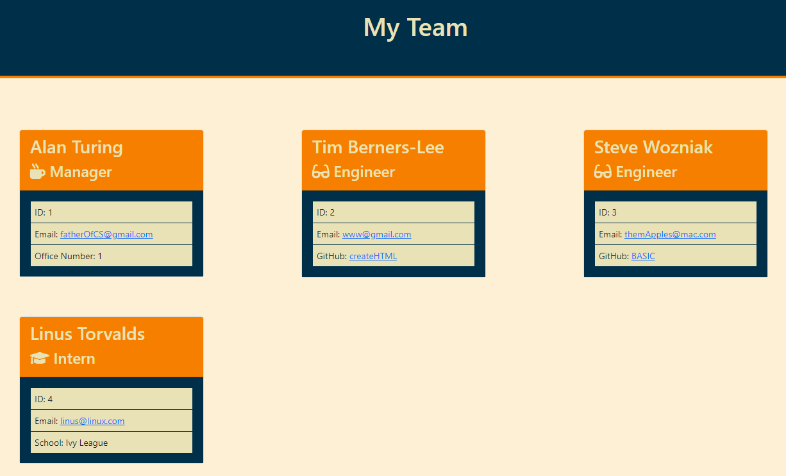

# Team Profile Generator

&nbsp;

## Program Description

This program runs from the command line. It prompts the user for the name, position, id number,  and email address of each team member.  If a team member's role is manager the user is also prompted for office number.  If a team member's role is engineer the user is also prompted for GitHub username. Finally, if the team member is an intern the user is prompted for the school attended. The program then takes the information collected and creates an html page that contains individual cards containing information for each team member.  

&nbsp;

[Link to GitHub Repository](https://github.com/Heath-Bennett/TeamProfileGenerator)

&nbsp;

## Table of Contents 

&nbsp;

* [Image of team.html](#image-of-team.html)
* [Resources Used](#Resources-Used)
* [Colors Used](#Colors-Used)
* [License](#License)

&nbsp;

## Image of team.html

&nbsp;

[Table of Contents](#Table-of-Contents)

&nbsp;

## Resources Used

&nbsp;

* [Bootstrap](https://getbootstrap.com/)
* [Coolors](https://coolors.co/)
* [fs](https://www.npmjs.com/package/fs)
* [Inquirer](https://www.npmjs.com/package/inquirer)
* [Node js](https://nodejs.org/en/)

[Table of Contents](#Table-of-Contents)

&nbsp;

## Colors Used

&nbsp;

`#003049`                  |  `#EAE287`                |`#F77F00`                 |`#FDF0D5`   
:-------------------------:|:-------------------------:|:-------------------------:|:-------------------------:
  |  | | 

[Table of Contents](#Table-of-Contents)

## License

&nbsp;

MIT License

Copyright (c) [2021] [Heath Bennett]

Permission is hereby granted, free of charge, to any person obtaining a copy
of this software and associated documentation files (the "Software"), to deal
in the Software without restriction, including without limitation the rights
to use, copy, modify, merge, publish, distribute, sublicense, and/or sell
copies of the Software, and to permit persons to whom the Software is
furnished to do so, subject to the following conditions:

The above copyright notice and this permission notice shall be included in all
copies or substantial portions of the Software.

THE SOFTWARE IS PROVIDED "AS IS", WITHOUT WARRANTY OF ANY KIND, EXPRESS OR
IMPLIED, INCLUDING BUT NOT LIMITED TO THE WARRANTIES OF MERCHANTABILITY,
FITNESS FOR A PARTICULAR PURPOSE AND NONINFRINGEMENT. IN NO EVENT SHALL THE
AUTHORS OR COPYRIGHT HOLDERS BE LIABLE FOR ANY CLAIM, DAMAGES OR OTHER
LIABILITY, WHETHER IN AN ACTION OF CONTRACT, TORT OR OTHERWISE, ARISING FROM,
OUT OF OR IN CONNECTION WITH THE SOFTWARE OR THE USE OR OTHER DEALINGS IN THE
SOFTWARE.

[Table of Contents](#Table-of-Contents)